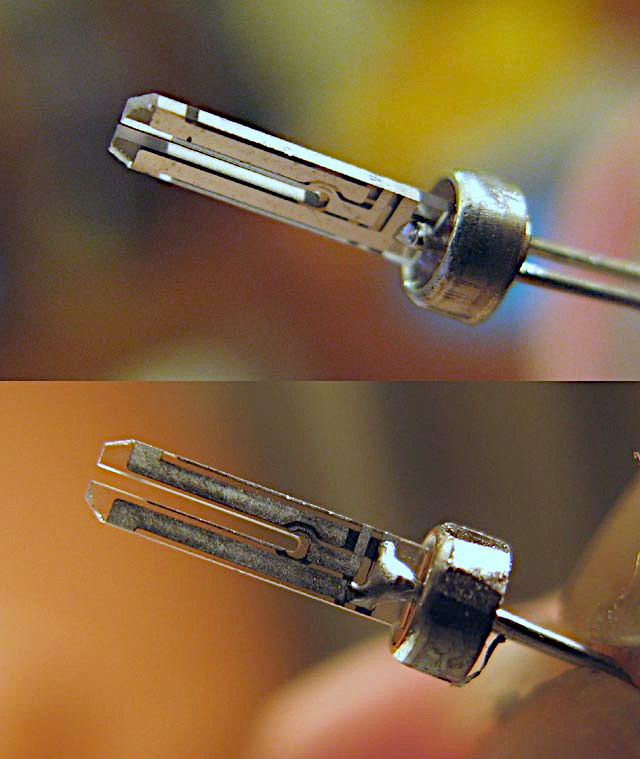
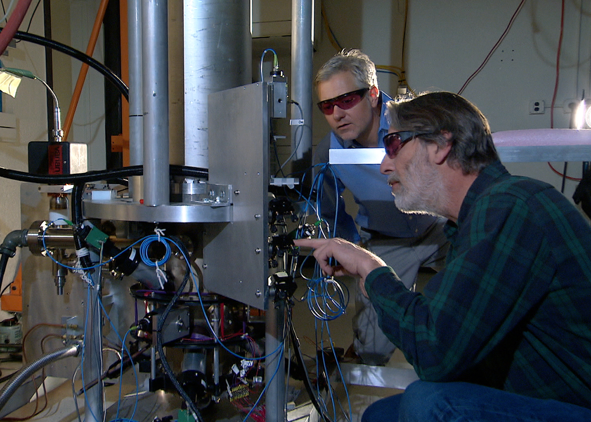

import JourneyMap from '~/components/trace/shared/JourneyMap.svelte'
import FrequencyDivider from '~/components/trace/clock/FrequencyDivider.svelte'
import CrystalDrift from '~/components/trace/clock/CrystalDrift.svelte'
import NTPHandshake from '~/components/trace/clock/NTPHandshake.svelte'
import RelativisticDrift from '~/components/trace/clock/RelativisticDrift.svelte'
import SystemDiagram from '~/components/trace/clock/SystemDiagram.svelte'

export const journeySteps = [
  { label: 'You look at two clocks', depth: 'human' },
  { label: 'A quartz crystal vibrates on your wrist', depth: 'hardware' },
  { label: '32,768 Hz divided down to 1 tick per second', depth: 'hardware' },
  { label: 'But quartz drifts', depth: 'physics' },
  { label: 'Your laptop asks the internet (NTP)', depth: 'protocol' },
  { label: 'The circular problem; four timestamps', depth: 'protocol' },
  { label: 'Time servers trace to atomic clocks', depth: 'system' },
  { label: 'Cesium-133: the definition of a second', depth: 'physics' },
  { label: 'Radio signals correct your watch', depth: 'network' },
  { label: 'GPS: relativity in your pocket', depth: 'physics' },
  { label: 'Both paths converge on the same atoms', depth: 'human' },
]

You looked at your wrist. 3:00 PM. You looked at your laptop. 3:00 PM.

Same second. Same moment.

Your watch has no WiFi, no Bluetooth, no internet connection of any kind. Your laptop has no idea the watch exists. There's no shared cable, no synchronization protocol, no hidden link between them.

And yet; the same second.

How?

## The Journey

Here's everything that happens between your wrist and the atoms:

<JourneyMap steps={journeySteps} current={0} client:visible />

---

## A Grain of Rice on Your Wrist

Your watch keeps time with a tiny piece of crystal. Quartz; the same mineral found in sand and granite. Inside the case, there's a fork-shaped sliver of it, roughly the size of a grain of rice.

It's vibrating right now. On your wrist. Thirty-two thousand times a second.

Quartz has a peculiar property. Squeeze it and it generates a tiny voltage. Apply a tiny voltage and it flexes. This is called the piezoelectric effect; "piezo" from the Greek word for "squeeze."

Pierre and Jacques Curie discovered this in 1880 by pressing quartz crystals and measuring the voltage that appeared. They were in their twenties. Forty-seven years later, in 1927, Warren Marrison and J.W. Horton at Bell Labs built the first clock that used a quartz crystal to keep time. It was the size of a room.

, public domain.")

The idea took another forty-two years to fit on a wrist.

:::tip[How We Know]
Pierre & Jacques Curie, ["Développement, par pression, de l'électricité polaire dans les cristaux"](https://www.aps.org/publications/apsnews/201403/physicshistory.cfm) (1880), *Comptes rendus* 91, 294-295. The original paper describing the piezoelectric effect.
Warren Marrison, ["The Evolution of the Quartz Crystal Clock"](https://ieeexplore.ieee.org/document/6773029) (1948), *Bell System Technical Journal* 27(3), 510-588. A retrospective on his 1927 quartz clock.
The first quartz wristwatch: Seiko Astron 35SQ, released December 25, 1969.
:::

Hook a quartz crystal into the right circuit, and it starts oscillating; flexing, generating voltage, flexing again, over and over, at a frequency determined by its physical shape and size. Cut the crystal to the right fork shape, the right thickness, and it oscillates at 32,768 times per second.

Not roughly. Not within a range. Every quartz crystal of this shape settles on the same number.

Why? Why would nature pick that number?

It didn't. We did. We cut the crystal to the shape that vibrates at 32,768 Hz. But why *that* number specifically?

32,768 is 2 to the power of 15. Two multiplied by itself fifteen times. And that matters because of what comes next.

<JourneyMap steps={journeySteps} current={2} client:visible />

## From 32,768 to 1

You have a crystal oscillating 32,768 times a second. You need one tick per second. You need to divide by 32,768.

There's a simple electronic component called a flip-flop. It takes an input signal that switches on and off at some frequency, and outputs a signal at half that frequency. Two input pulses become one output pulse.

Chain fifteen flip-flops together.

The first takes 32,768 Hz and outputs 16,384 Hz. The second takes 16,384 and outputs 8,192. Then 4,096. Then 2,048.

After fifteen stages: 32,768 → 16,384 → 8,192 → 4,096 → 2,048 → 1,024 → 512 → 256 → 128 → 64 → 32 → 16 → 8 → 4 → 2 → 1.

One pulse per second. A clock.

<FrequencyDivider client:visible />

This is why the number is a power of two. If the crystal vibrated at, say, 30,000 Hz, you couldn't divide it to exactly 1 Hz with flip-flops alone. You'd need more complicated circuitry. But 2^15 divides to 1 in exactly fifteen binary steps. Elegant. Cheap. Tiny enough to fit in a wristwatch.

The whole trick: find a crystal that vibrates at a power of two. Chain fifteen dividers together. You have a clock.

:::tip[How We Know]
The 32,768 Hz frequency became the universal standard after Seiko's Astron (1969). It wasn't the only option; early quartz clocks used frequencies as high as 100 kHz. But 2^15 offered the best tradeoff between accuracy and power consumption for a battery-powered wristwatch. Today, virtually every quartz watch, wall clock, and microcontroller real-time clock uses this frequency.
— [IEC 60122-3](https://www.jauch.com/blog/en/tuning-fork-crystal-frequency-32768-khz/), "Quartz crystal units for frequency control and selection," specifies the 32,768 Hz tuning fork standard.
:::

Except you don't.

Because quartz drifts.

<JourneyMap steps={journeySteps} current={3} client:visible />

## The Problem with "Perfect"

The crystal's oscillation frequency depends on temperature. Heat it up, it vibrates slightly faster. Cool it down, slightly slower. The crystal also ages; its properties change imperceptibly over months and years as the atomic structure shifts.

A typical watch crystal drifts about 6 parts per million. That sounds tiny.

Here's what it means: your watch gains or loses about half a second per day. 15 seconds per month. After a year, it's off by nearly three minutes.

:::tip[How We Know]
Casio specifies G-Shock accuracy at ±15 seconds per month (≈ 5.8 ppm) under normal conditions (5°C to 35°C). Temperature is the dominant factor; a quartz crystal's frequency-temperature curve follows a parabola with its turnover point near 25°C.
— Casio G-Shock module specifications; also [IEEE Std 1139-2022](https://standards.ieee.org/ieee/1139/7585/), "Standard Definitions of Physical Quantities for Fundamental Frequency and Time Metrology."
:::

<CrystalDrift client:visible />

You looked at your watch and your laptop. Same second. If the watch drifts half a second per day, they should disagree after 48 hours. After a month, the watch should be fifteen seconds off. After six months, a minute and a half.

They don't disagree.

So either your watch isn't drifting, or something is correcting for the drift.

<JourneyMap steps={journeySteps} current={4} client:visible />

## Your Laptop's Solution

Your laptop has the same fundamental problem; quartz oscillator in the chipset, same slow drift.

Different solution.

It asks someone else.

Every few minutes, your computer sends a message over the internet to a time server; a machine whose only job is knowing the exact time. "What time is it?" The server replies. Your laptop adjusts its clock.

Simple.

Except there's a problem that shouldn't have a solution.

## The Circular Problem

The message takes time to travel. Your laptop sends "what time is it?" at (what it thinks is) 1:00:00.000. The server receives the message, checks its clock, and replies: "It's 1:00:00.050."

Your laptop gets the reply. The server said 1:00:00.050. But some time has passed since then. How much? You'd need to know how long the message took to travel back. And to measure that travel time, you'd need to know the exact time at both ends.

Which is the thing you're trying to figure out.

You can't measure the travel time without knowing the correct time, and you can't know the correct time without measuring the travel time.

It's circular. There shouldn't be a solution to this.

David Mills found one in 1985.

<JourneyMap steps={journeySteps} current={5} client:visible />

## Four Timestamps

You don't need the one-way travel time. You need four timestamps.

Here's what happens:

1. **T1**: Your laptop records the time it sends the request.
2. **T2**: The server records the time it receives the request.
3. **T3**: The server records the time it sends the reply.
4. **T4**: Your laptop records the time it receives the reply.

The round-trip time: (T4 - T1) - (T3 - T2). That's the total time from send to receive, minus the time the server spent processing. Divide by two; that's the estimated one-way delay.

The clock offset; how wrong your clock is: ((T2 - T1) + (T3 - T4)) / 2.

<NTPHandshake client:visible />

This is the Network Time Protocol. NTP. Mills first described it in RFC 958 in 1985 and spent the next four decades refining it. He was a professor at the University of Delaware. He maintained the reference implementation, wrote the specification through four major versions, and fielded bug reports; nearly single-handedly. He passed away in January 2024. The protocol that keeps every computer on Earth synchronized was, for most of its life, one person's obsession.

:::tip[How We Know]
David L. Mills, ["Network Time Protocol"](https://www.rfc-editor.org/rfc/rfc958.html) (1985), RFC 958. The original specification.
David L. Mills, ["Network Time Protocol Version 4"](https://www.rfc-editor.org/info/rfc5905) (2010), RFC 5905. The current specification. The four-timestamp algorithm has remained essentially unchanged since 1985.
:::

Try dragging the delay sliders above so the outbound and return delays are different. Watch what happens to the calculated offset.

### The Catch

The math assumes symmetric paths. Same delay in both directions. If the outbound message takes 10ms and the return takes 50ms, NTP gets it wrong. And there's no way to detect this asymmetry from the four timestamps alone.

So NTP makes many measurements, throws out outliers, and picks the sample with the lowest round-trip time; which is most likely to have the most symmetric path. In practice, this gets your laptop within a few milliseconds of the correct time.

Good enough for a desktop clock. Not good enough for GPS.

<JourneyMap steps={journeySteps} current={6} client:visible />

## Where Does the Time Server Get Its Time?

Your laptop asks a time server. That time server asks a better time server. That one asks an even better one.

It's time servers all the way up.

At the top of the hierarchy: atomic clocks.

## Atoms Don't Drift

A quartz crystal vibrates at a frequency determined by its physical shape. Cut a different shape, different frequency. This is precisely the problem; the frequency depends on manufacturing precision, temperature, aging.

An atom doesn't have these problems.

Every cesium-133 atom in the universe is identical. Not similar. Identical. When you expose cesium-133 atoms to a specific type of electromagnetic wave; microwaves, at exactly 9,192,631,770 cycles per second; something specific happens. Electrons in the atom jump between two energy levels. This is called the hyperfine transition.

This frequency is a property of the atom itself. It doesn't depend on temperature. It doesn't age. It doesn't drift. It's the same in Colorado, Tokyo, and the far side of the galaxy.

In 1955, Louis Essen and Jack Parry at the National Physical Laboratory in Teddington, England, built the first cesium clock accurate enough to challenge the astronomical definition of the second. They measured the cesium frequency against the existing astronomical second and got 9,192,631,770 cycles. Twelve years later, in 1967, the 13th General Conference on Weights and Measures voted to redefine the second:

> **One second = 9,192,631,770 oscillations of the cesium-133 hyperfine transition.**

They didn't measure the second. They *defined* it. The second IS that many oscillations of a cesium atom. Everything else; your watch, your microwave clock, the Earth's rotation; is an approximation.

NIST-F2, the primary time standard of the United States, keeps time to about one second in 300 million years. You would have to wait from the Carboniferous period; when the first reptiles appeared; to today, for it to be off by one second.

:::tip[How We Know]
Louis Essen & Jack Parry, ["An Atomic Standard of Frequency and Time Interval: A Caesium Resonator"](https://www.nature.com/articles/176280a0) (1955), *Nature* 176, 280-282.
The redefinition: [13th CGPM, Resolution 1](https://www.bipm.org/en/committees/cg/cgpm/13-1967/resolution-1) (1967). The exact number 9,192,631,770 came from Essen and Parry's measurement.
NIST-F2 accuracy: T.P. Heavner et al., ["First accuracy evaluation of NIST-F2"](https://www.nist.gov/publications/first-accuracy-evaluation-nist-f2) (2014), *Metrologia* 51, 174-182. Uncertainty of 1 × 10⁻¹⁶, corresponding to ~1 second in 300 million years.
:::

<JourneyMap steps={journeySteps} current={8} client:visible />

## How the Time Gets to Your Watch

Your laptop gets atomic time through the internet; NTP. What about your watch?

Some watches have a radio receiver built in. In the United States, a station called WWVB in Fort Collins, Colorado broadcasts a 60,000 Hz radio signal, twenty-four hours a day, encoding the current time in its pulses.

 Your watch picks up this signal; usually at night, when radio waves in this frequency range travel farther because of how the upper atmosphere reflects them; and corrects its quartz oscillator.

In Japan: JJY, broadcasting at 40,000 and 60,000 Hz. In Europe: DCF77, at 77,500 Hz. In China: BPC, at 68,500 Hz. Different stations, different frequencies, same idea. Atomic clocks broadcasting the time by radio.

:::tip[How We Know]
WWVB has been broadcasting from Fort Collins since 1963. NIST operates it alongside the WWV shortwave station, which has been broadcasting time signals since 1920; making it one of the oldest continuously operating radio stations in the United States.
— [NIST Special Publication 432](https://www.nist.gov/publications/nist-time-and-frequency-services), "NIST Time and Frequency Services" (2002, updated).
:::

If your watch doesn't have a radio receiver, it's just very good quartz. The drift is there. You either correct it manually or you don't notice, because fifteen seconds a month isn't catastrophic for a wristwatch.

<JourneyMap steps={journeySteps} current={9} client:visible />

## GPS: When Milliseconds Aren't Enough

Thirty-one satellites orbit the Earth at 20,200 kilometers altitude. Each one carries atomic clocks; rubidium and cesium. Each one broadcasts: "I am at this position, and the time is this."

Your phone receives these signals from four or more satellites. The signals travel at the speed of light. The time delay between when the satellite sent the signal and when your phone received it tells you the distance to that satellite. Four distances; four overlapping spheres in space; pin down your position to within a few meters.

The timing has to be extraordinary. Light covers 30 centimeters in one nanosecond; a billionth of a second. A 10-nanosecond timing error means 3 meters of position error. A microsecond; a millionth of a second; means 300 meters.

Here's where it gets strange.

## The Relativity Correction

GPS satellites orbit at 20,200 km altitude, moving at about 14,000 km/h. Two consequences from Einstein's relativity:

**Moving clocks run slow.** This is special relativity, published in 1905. The satellite's velocity makes its clock tick slower than a clock sitting still on the ground, by about 7 microseconds per day.

**Clocks in weaker gravity run fast.** This is general relativity, published in 1915. The satellite is farther from Earth's gravitational pull, so its clock ticks faster than one on the surface, by about 45 microseconds per day.

The two effects work against each other. Net result: satellite clocks run 38 microseconds per day faster than clocks on the ground.

38 microseconds per day. Light covers 11.4 kilometers in 38 microseconds. Without the relativistic correction, your phone's GPS position would drift about 10 kilometers per day. By Friday, it would place you in a different city.

<RelativisticDrift client:visible />

There is a correction factor in the firmware of every GPS satellite, applied to every timing signal, every second of every day, that accounts for general relativity.

The correction isn't theoretical. When the first experimental GPS satellite (NTS-2) launched in 1977, the engineers deliberately included a switch to turn the relativistic correction on and off. They wanted to see if Einstein was right. He was. Without the correction, the clock drifted exactly as predicted. They turned it on and left it on.

Einstein published general relativity in 1915. The first GPS satellite launched in 1978. For sixty-three years, the theory had no consumer application. Now it runs in your pocket.

:::tip[How We Know]
Neil Ashby, ["Relativity in the Global Positioning System"](https://link.springer.com/article/10.12942/lrr-2003-1) (2003), *Living Reviews in Relativity* 6, 1. The definitive review of all relativistic effects in GPS, including the NTS-2 verification experiment.
The specific numbers: special relativistic time dilation of -7.2 μs/day and general relativistic gravitational blueshift of +45.8 μs/day are derived from the Schwarzschild metric at GPS orbital parameters (semi-major axis 26,561.75 km, eccentricity ~0.02).
— [GPS Interface Control Document IS-GPS-200](https://www.navcen.uscg.gov/gps-technical-references), which specifies the relativistic correction term in the navigation message.
:::

<JourneyMap steps={journeySteps} current={-1} client:visible />

## The Loop Closes

<SystemDiagram client:visible />

Your watch and your laptop both say 3:00 PM.

Your watch: a quartz crystal vibrating 32,768 times per second, divided down by fifteen flip-flops to one tick per second, corrected periodically by a radio signal from Fort Collins, Colorado that traces back to a cesium atomic clock at NIST.

Your laptop: a quartz oscillator in the chipset, corrected every few minutes by NTP, which traces up through a hierarchy of time servers to atomic clocks maintained by national standards labs around the world.

Two completely independent paths. No shared cable. No direct communication. Both traceable; through different routes; to the same physical constant: the hyperfine transition frequency of cesium-133.

They agree not because they talked to each other.

They agree because they're both listening to atoms.

## Time at Every Level

| Layer | What "time" IS at this layer |
|---|---|
| Your experience | The number on your wrist; the clock on your screen |
| Application | A system call that returns a number |
| Protocol | NTP's four timestamps; an offset and a delay |
| Network | Radio signals encoding time; WWVB, JJY, DCF77 |
| Satellite | GPS timing signals with relativistic corrections |
| Atomic physics | 9,192,631,770 oscillations of cesium-133 |
| Quantum mechanics | An electron transitioning between hyperfine energy levels |

## Further Reading

- [**RFC 5905: Network Time Protocol Version 4**](https://www.rfc-editor.org/info/rfc5905) — The actual specification. Dense but definitive. If you want to know exactly how NTP selects peers, filters measurements, and disciplines the clock, this is the document.

- **David Mills, *Computer Network Time Synchronization* (2006)** — The definitive reference by NTP's creator, covering the protocol's design, algorithms, and decades of evolution. Mills passed away in 2024; this book is his life's work.

- [**Richard Pogge, "Real-World Relativity: The GPS Navigation System"**](https://www.astronomy.ohio-state.edu/pogge.1/Ast162/Unit5/gps.html) — An excellent walkthrough of the relativistic corrections in GPS with the actual numbers. Written for a university astronomy course; the math is accessible.

- [**NIST, "A New Era for Atomic Clocks"**](https://www.nist.gov/news-events/news/2014/02/new-era-atomic-clocks) — NIST's overview of their cesium and optical lattice clocks. Optical lattice clocks are the next generation; they're about 100 times more accurate than cesium. The definition of the second may change again.

- **Charles Kittel, *Introduction to Solid State Physics*** — The standard reference for understanding piezoelectric crystals and why quartz oscillates the way it does. Chapter on dielectrics and ferroelectrics covers the physics.

:::note[Connection]
Time synchronization is the foundation of distributed systems. When two computers need to agree on the order of events, they need to agree on time; or find a way around it. We'll explore this in the Distributed Systems post, where Lamport clocks and vector clocks offer a different answer to "what happened first?"
:::
