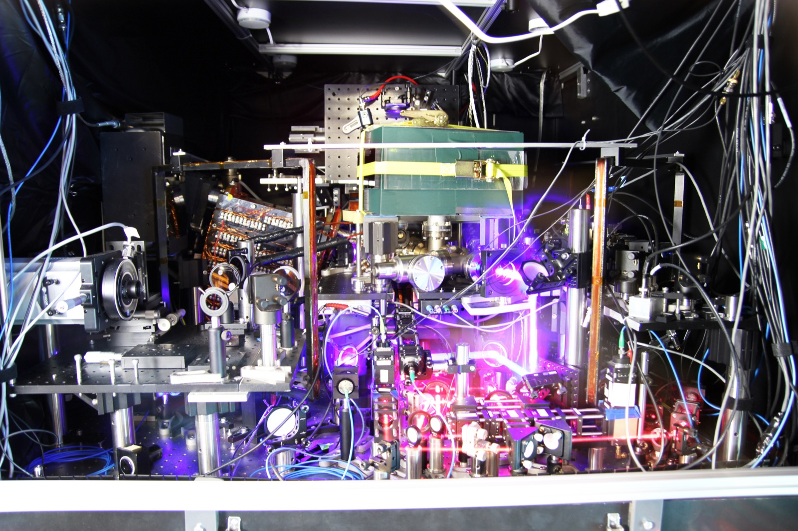
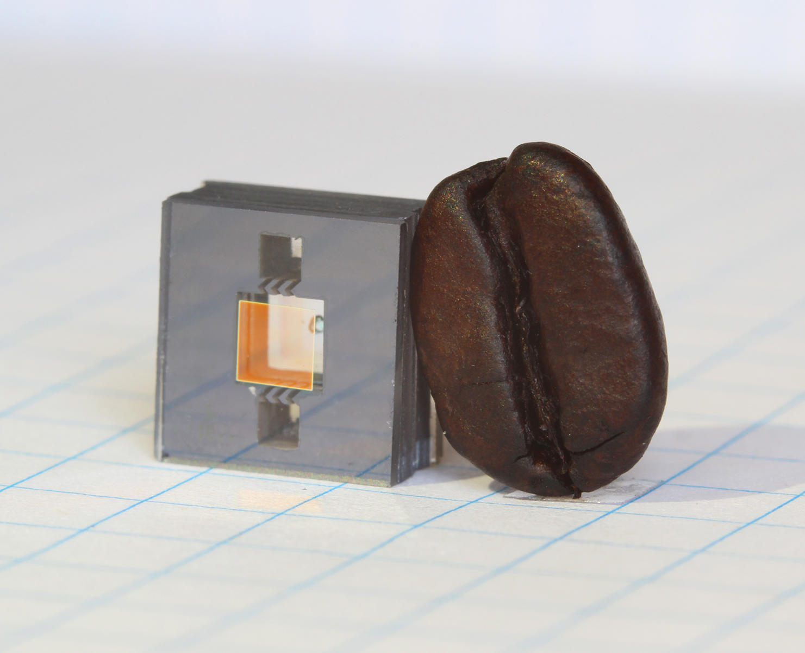

import JourneyMap from '~/components/trace/shared/JourneyMap.svelte'
import FrequencyDivider from '~/components/trace/clock/FrequencyDivider.svelte'
import CrystalDrift from '~/components/trace/clock/CrystalDrift.svelte'
import NTPHandshake from '~/components/trace/clock/NTPHandshake.svelte'
import RelativisticDrift from '~/components/trace/clock/RelativisticDrift.svelte'
import SystemDiagram from '~/components/trace/clock/SystemDiagram.svelte'
import TimeAsState from '~/components/trace/clock/TimeAsState.svelte'
import CesiumFeedbackLoop from '~/components/trace/clock/CesiumFeedbackLoop.svelte'
import SlewVsJump from '~/components/trace/clock/SlewVsJump.svelte'
import StratumHierarchy from '~/components/trace/clock/StratumHierarchy.svelte'
import IonosphereReflection from '~/components/trace/clock/IonosphereReflection.svelte'
import PiezoelectricCycle from '~/components/trace/clock/PiezoelectricCycle.svelte'
import TemperatureParabola from '~/components/trace/clock/TemperatureParabola.svelte'
import HyperfineTransition from '~/components/trace/clock/HyperfineTransition.svelte'
import LaptopClockArchitecture from '~/components/trace/clock/LaptopClockArchitecture.svelte'
import ThreePathsToPhone from '~/components/trace/clock/ThreePathsToPhone.svelte'
import ClockAccuracyScale from '~/components/trace/clock/ClockAccuracyScale.svelte'
import FlipFlop from '~/components/trace/clock/FlipFlop.svelte'
import GPSTrilateration from '~/components/trace/clock/GPSTrilateration.svelte'

export const journeySteps = [
  { label: 'You look at two clocks', depth: 'human' },
  { label: 'A quartz crystal vibrates on your wrist', depth: 'hardware' },
  { label: '32,768 Hz divided down to 1 tick per second', depth: 'hardware' },
  { label: 'But quartz drifts', depth: 'physics' },
  { label: 'Your laptop asks the internet (NTP)', depth: 'protocol' },
  { label: 'The circular problem; four timestamps', depth: 'protocol' },
  { label: 'Time servers trace to atomic clocks', depth: 'system' },
  { label: 'Cesium-133: the definition of a second', depth: 'physics' },
  { label: 'Radio signals correct your watch', depth: 'network' },
  { label: 'GPS: relativity in your pocket', depth: 'physics' },
  { label: 'Both paths converge on the same atoms', depth: 'human' },
]

You looked at your wrist. 3:00 PM. You looked at your laptop. 3:00 PM.

Same second. Same moment.

Your watch has no WiFi, no Bluetooth, no internet connection of any kind. Your laptop has no idea the watch exists. There's no shared cable, no synchronization protocol, no hidden link between them.

And yet; the same second.

How?

## The Journey

Here's everything that happens between your wrist and the atoms:

<JourneyMap steps={journeySteps} current={0} client:visible />

---

## A Grain of Rice on Your Wrist

Your watch keeps time with a tiny piece of crystal. Quartz; the same mineral found in sand and granite. Inside the case, there's a fork-shaped sliver of it, roughly the size of a grain of rice.

It's vibrating right now. On your wrist. Thirty-two thousand times a second.

Quartz has a peculiar property. Squeeze it and it generates a tiny voltage. Apply a tiny voltage and it flexes. This is called the piezoelectric effect; "piezo" from the Greek word for "squeeze."

Pierre and Jacques Curie discovered this in 1880 by pressing quartz crystals and measuring the voltage that appeared. They were in their twenties. Forty-seven years later, in 1927, Warren Marrison and J.W. Horton at Bell Labs built the first clock that used a quartz crystal to keep time. It was the size of a room.

, public domain.")

The idea took another forty-two years to fit on a wrist.

:::tip[How We Know]
Pierre & Jacques Curie, ["Développement, par pression, de l'électricité polaire dans les cristaux"](https://www.aps.org/publications/apsnews/201403/physicshistory.cfm) (1880), *Comptes rendus* 91, 294-295. The original paper describing the piezoelectric effect.
Warren Marrison, ["The Evolution of the Quartz Crystal Clock"](https://ieeexplore.ieee.org/document/6773029) (1948), *Bell System Technical Journal* 27(3), 510-588. A retrospective on his 1927 quartz clock.
The first quartz wristwatch: Seiko Astron 35SQ, released December 25, 1969.
:::

Hook a quartz crystal into the right circuit, and it starts oscillating; flexing, generating voltage, flexing again, over and over, at a frequency determined by its physical shape and size. The crystal alone would damp out in microseconds; the oscillator circuit amplifies each tiny voltage and feeds it back, sustaining the vibration indefinitely:

<PiezoelectricCycle />

Cut the crystal to the right fork shape, the right thickness, and it oscillates at 32,768 times per second.

Not roughly. Not within a range. Every quartz crystal of this shape settles on the same number.

Why? Why would nature pick that number?

It didn't. We did. We cut the crystal to the shape that vibrates at 32,768 Hz; hertz, cycles per second. But why *that* number specifically?

32,768 is 2 to the power of 15. Two multiplied by itself fifteen times. And that matters because of what comes next.

<JourneyMap steps={journeySteps} current={2} client:visible />

## From 32,768 to 1

You have a crystal oscillating 32,768 times a second. You need one tick per second. You need to divide by 32,768.

There's a simple electronic component called a flip-flop. It takes an input signal that switches on and off at some frequency, and outputs a signal at half that frequency. Two input pulses become one output pulse.

Send a few pulses below and watch what happens. Each flip-flop toggles on every input pulse, but only passes a pulse onward when it transitions from HIGH back to LOW. The result: each stage halves the frequency.

<FlipFlop client:visible />

Chain fifteen flip-flops together.

The first takes 32,768 Hz and outputs 16,384 Hz. The second takes 16,384 and outputs 8,192. Then 4,096. Then 2,048.

After fifteen stages: 32,768 → 16,384 → 8,192 → 4,096 → 2,048 → 1,024 → 512 → 256 → 128 → 64 → 32 → 16 → 8 → 4 → 2 → 1.

One pulse per second. A clock.

<FrequencyDivider client:visible />

This is why the number is a power of two. If the crystal vibrated at, say, 30,000 Hz, you couldn't divide it to exactly 1 Hz with flip-flops alone. You'd need more complicated circuitry. But 2^15 divides to 1 in exactly fifteen binary steps. Elegant. Cheap. Tiny enough to fit in a wristwatch.

The whole trick: find a crystal that vibrates at a power of two. Chain fifteen dividers together. You have a clock.

:::tip[How We Know]
The 32,768 Hz frequency became the universal standard after Seiko's Astron (1969). It wasn't the only option; early quartz clocks used frequencies as high as 100 kHz. But 2^15 offered the best tradeoff between accuracy and power consumption for a battery-powered wristwatch. Today, virtually every quartz watch, wall clock, and microcontroller real-time clock uses this frequency.
— [IEC 60122-3](https://www.jauch.com/blog/en/tuning-fork-crystal-frequency-32768-khz/), "Quartz crystal units for frequency control and selection," specifies the 32,768 Hz tuning fork standard.
:::

Except you don't.

Because quartz drifts.

<JourneyMap steps={journeySteps} current={3} client:visible />

## The Problem with "Perfect"

The crystal's oscillation frequency depends on temperature. Its frequency follows a gentle parabola that peaks near room temperature; deviations in either direction slow it down.

<TemperatureParabola />

The crystal also ages; its properties change imperceptibly over months and years as the atomic structure shifts.

A typical watch crystal drifts about 6 parts per million. That sounds tiny.

Here's what it means: your watch gains or loses about half a second per day. 15 seconds per month. After a year, it's off by nearly three minutes.

:::tip[How We Know]
Casio specifies G-Shock accuracy at ±15 seconds per month (≈ 5.8 ppm) under normal conditions (5°C to 35°C). Temperature is the dominant factor; a quartz crystal's frequency-temperature curve follows a parabola with its turnover point near 25°C.
— Casio G-Shock module specifications; also [IEEE Std 1139-2022](https://standards.ieee.org/ieee/1139/7585/), "Standard Definitions of Physical Quantities for Fundamental Frequency and Time Metrology."
:::

<CrystalDrift client:visible />

You looked at your watch and your laptop. Same second. If the watch drifts half a second per day, they should disagree after 48 hours. After a month, the watch should be fifteen seconds off. After six months, a minute and a half.

They don't disagree.

So either your watch isn't drifting, or something is correcting for the drift.

But before we get to how; what does "correcting" a clock even mean?

## What Does "Setting" a Clock Mean?

Your watch crystal is vibrating at 32,768 Hz. The flip-flop chain divides that down to one pulse per second. But where does the time live?

In more flip-flops.

The same circuit element that divides the frequency also stores the count. After the fifteenth divider outputs a 1 Hz pulse, that pulse feeds into a cascade of flip-flops arranged as counters. The counters store time in Binary-Coded Decimal; BCD; where each decimal digit gets four bits. The seconds digit 5 is stored as 0101: zero eights, one four, zero twos, one one. Each bit is one flip-flop.

Hours: eight flip-flops (two BCD digits). Minutes: eight. Seconds: eight. Twenty-four flip-flops total. That's the time on your wrist.

Here's what 23:59:55 looks like inside your watch; and inside your laptop's RTC chip:

<TimeAsState client:visible />

Hit **+1 sec** a few times. Watch which bits flip. Then jump to **23:59:55** and hit **Play** to watch midnight arrive; nearly all 24 bits cascade at once.

Each green cell is a flip-flop: two transistors wired in a loop, one conducting and the other held off. That's a stable state; it stays there, drawing a trickle of current from the watch battery, until a pulse from the counter circuit flips it. HIGH means one transistor is conducting, pulling its output toward the battery's 1.5 volts. LOW means the other transistor conducts, pulling the output to zero. Two stable states, nothing in between.

The "time" on your wrist is not a number in the way you might imagine; not a value stored in a file, not bytes in memory. It's a pattern of voltages across twenty-four transistor pairs on a chip smaller than your fingernail. Remove the battery, and these voltages collapse in milliseconds. The flip-flops settle to undefined states. The time is gone. Not erased; it was never *written* anywhere. It existed only as sustained electrical state.

When you pull the crown and press a button, you send a signal to the chip that forces specific flip-flops to change; incrementing the hours or minutes register until the display matches what you want. The crystal doesn't notice. The divider chain doesn't notice. You're rearranging transistor states.

### The First Tick

Here's an odd consequence. When you put a battery in a brand-new watch, the crystal starts oscillating within microseconds. The divider chain starts dividing. The 24 counter flip-flops start from their reset state; all zeros. The display shows 12:00:00.

The watch is counting real oscillations. Real, physical vibrations of quartz. Every one of those seconds is an accurate second. But the *time* is meaningless; it's counting from an arbitrary starting point. The physics is correct. The meaning is absent.

It becomes a clock the moment you set it.

### Your Laptop's Version

Your laptop does this too, with more layers. Inside the machine, a small chip called the Real-Time Clock sits on the motherboard with its own quartz crystal; vibrating at 32,768 Hz, same as your watch; and its own tiny battery. That coin cell.

The RTC chip stores time in a few bytes of battery-backed memory; static RAM, where each bit is a latch: six transistors instead of two, but the same principle. Two cross-coupled inverters hold a stable state. The BCD encoding is identical to the watch: the byte at register address 0x00 holds seconds, 0x02 holds minutes, 0x04 holds hours. Same bit patterns. Same BCD. Different transistor arrangement on a different chip, kept alive by a different battery.

The RTC's own divider chain produces a 1 Hz pulse that increments the seconds byte. When seconds reaches 60, it resets and increments minutes. Same cascade as the watch.

The coin-cell battery keeps this crystal oscillating and this memory powered even when the computer is off. Unplug your laptop for three weeks. Plug it back in. The RTC has been counting the whole time. Not accurately; it's quartz, it drifts; but close enough.

When the computer boots, the operating system reads the RTC's bytes; on x86 hardware, through I/O ports 0x70 and 0x71, a convention that dates back to the original IBM PC in 1981. That gives the OS a rough starting time.

Then the OS starts its own clock. Not the RTC; something faster. The kernel reads a high-resolution hardware counter built into the main processor; the CPU's Time Stamp Counter (TSC), which ticks at billions of cycles per second, and stores a base time in memory: "at this counter value, the real time was X." Every call to check the time; every `clock_gettime()`, every glance at the menu bar clock; computes: base time + (counter ticks since base × nanoseconds per tick).

<LaptopClockArchitecture />

When you open Date & Time settings and type in "3:00 PM," the operating system writes a new base time to the kernel's timekeeping structure and syncs it back to the RTC chip. Pulling the crown on a watch, but with electrons instead of gears: you changed a stored reference point. The crystals; both of them, the RTC's and the CPU's; didn't notice.

### The Slew

There's a subtlety here that matters. When an outside correction arrives; we'll see where it comes from next; it could just overwrite the base time. Jump forward 200 milliseconds. But sudden jumps cause problems. Files get timestamps from the future. Log entries appear out of order. Running programs get confused about how much time has passed.

So the correction does something cleverer: it *slews* the clock. It adjusts the nanoseconds-per-tick multiplier; making each tick count for slightly more or slightly less time; so the clock drifts gently toward the correct time. No discontinuity. The crystal oscillates at the same frequency; the kernel just temporarily reinterprets what each oscillation means.

<SlewVsJump client:visible />

Setting a clock; whether by turning a crown, overwriting an RTC register, or slewing the kernel's tick rate; never changes any oscillation. The quartz doesn't care. You're only ever adjusting which count corresponds to "now."

<JourneyMap steps={journeySteps} current={4} client:visible />

## Your Laptop's Solution

Your laptop has the same fundamental problem; quartz oscillator in the chipset, same slow drift.

Different solution.

It asks someone else.

Every few minutes, your computer sends a message over the internet to a time server; a machine whose only job is knowing the exact time. "What time is it?" The server replies. Your laptop adjusts its clock.

Simple.

Except there's a problem that shouldn't have a solution.

## The Circular Problem

The message takes time to travel. Your laptop sends "what time is it?" at (what it thinks is) 1:00:00.000. The server receives the message, checks its clock, and replies: "It's 1:00:00.050."

Your laptop gets the reply. The server said 1:00:00.050. But some time has passed since then. How much? You'd need to know how long the message took to travel back. And to measure that travel time, you'd need to know the exact time at both ends.

Which is the thing you're trying to figure out.

You can't measure the travel time without knowing the correct time, and you can't know the correct time without measuring the travel time.

It's circular. There shouldn't be a solution to this.

David Mills found one in 1985.

<JourneyMap steps={journeySteps} current={5} client:visible />

## Four Timestamps

You don't need the one-way travel time. You need four timestamps.

Here's what happens:

1. **T1**: Your laptop records the time it sends the request.
2. **T2**: The server records the time it receives the request.
3. **T3**: The server records the time it sends the reply.
4. **T4**: Your laptop records the time it receives the reply.

The round-trip time: (T4 - T1) - (T3 - T2). That's the total time from send to receive, minus the time the server spent processing. Divide by two; that's the estimated one-way delay.

The clock offset; how wrong your clock is: ((T2 - T1) + (T3 - T4)) / 2.

<NTPHandshake client:visible />

Try dragging the delay sliders so the outbound and return delays are different. Watch what happens to the calculated offset.

This is the Network Time Protocol. NTP. Mills first described it in RFC 958 in 1985 and spent the next four decades refining it. He was a professor at the University of Delaware. He maintained the reference implementation, wrote the specification through four major versions, and fielded bug reports; nearly single-handedly. He passed away in January 2024. The protocol that keeps every computer on Earth synchronized was, for most of its life, one person's obsession.

:::tip[How We Know]
David L. Mills, ["Network Time Protocol"](https://www.rfc-editor.org/rfc/rfc958.html) (1985), RFC 958. The original specification.
David L. Mills, ["Network Time Protocol Version 4"](https://www.rfc-editor.org/info/rfc5905) (2010), RFC 5905. The current specification. The four-timestamp algorithm has remained essentially unchanged since 1985.
:::

### The Catch

The math assumes symmetric paths. Same delay in both directions. If the outbound message takes 10ms and the return takes 50ms, NTP gets it wrong. And there's no way to detect this asymmetry from the four timestamps alone.

So NTP makes many measurements, throws out outliers, and picks the sample with the lowest round-trip time; which is most likely to have the most symmetric path. In practice, this gets your laptop within a few milliseconds of the correct time. And if every server is unreachable; you're on a plane, or behind a strict firewall; the laptop falls back to its quartz oscillator alone, drifting until the next successful sync.

Good enough for a desktop clock. Not good enough for GPS.

<JourneyMap steps={journeySteps} current={6} client:visible />

## Where Does the Time Server Get Its Time?

Your laptop asks a time server. That time server asks a better time server. That one asks an even better one.

NTP organizes this chain into layers called *strata*. At the top: stratum 0. The atomic clocks themselves; cesium fountains at NIST in Boulder, at PTB in Braunschweig, the clocks aboard GPS satellites. These are the sources of truth.

But an atomic clock isn't a network device. NIST-F2 doesn't have an Ethernet port. It's a laboratory instrument that outputs a frequency reference; a signal locked to the cesium transition. So stratum 1 servers sit in the same facility, connected by a direct physical link. A serial cable running to a cesium clock in the next room. A GPS antenna bolted to the roof, decoding satellite time signals. No network hops between the atom and the server. The connection is a wire.

Stratum 1 servers serve stratum 2. Stratum 2 serves stratum 3. Your laptop usually talks to stratum 2 or 3; two or three hops from an atom.

<StratumHierarchy client:visible />

Why the hierarchy? Why can't every device just query stratum 1 directly?

Scale. There are billions of internet-connected devices that need to know the time. There are roughly three hundred stratum 1 servers worldwide. If every laptop, phone, and server on Earth queried stratum 1, the servers would collapse under the load. The hierarchy is a fan-out: each stratum 1 server feeds dozens of stratum 2 servers. Each stratum 2 feeds thousands of clients. The pyramid distributes the load.

The [NTP Pool Project](https://www.ntppool.org/) makes this concrete. Thousands of volunteers around the world run NTP servers and donate them to a shared pool. When your computer queries `pool.ntp.org`, DNS returns a different volunteer server each time, spreading the load across the whole network. Your laptop might be getting its time from a machine in someone's apartment in Frankfurt. That machine got its time from a stratum 1 server at the Physikalisch-Technische Bundesanstalt. The chain holds.

And your laptop doesn't trust any single server. It queries several; typically four; and cross-checks them against each other. If three agree within a few milliseconds and one disagrees wildly, the outlier is discarded. NTP's *intersection algorithm* finds the largest group of servers whose time estimates overlap and rejects anything outside that consensus. A broken clock, a compromised server, a congested network path; any single failure gets outvoted. The system's reliability comes not from the perfection of any one link, but from redundancy across many.

<JourneyMap steps={journeySteps} current={7} client:visible />

## Atoms Don't Drift

A quartz crystal vibrates at a frequency determined by its physical shape. Cut a different shape, different frequency. This is precisely the problem; the frequency depends on manufacturing precision, temperature, aging.

An atom doesn't have these problems.

Every cesium-133 atom in the universe is identical. Not similar. Identical. When you expose cesium-133 atoms to a specific type of electromagnetic wave; microwaves, at exactly 9,192,631,770 cycles per second; something specific happens. Electrons in the atom jump between two energy levels. This is called the hyperfine transition.

<HyperfineTransition />

This frequency is a property of the atom itself. It doesn't depend on temperature. It doesn't age. It doesn't drift. It's the same in Colorado, Tokyo, and the far side of the galaxy.

In 1955, Louis Essen and Jack Parry at the National Physical Laboratory in Teddington, England, built the first cesium clock accurate enough to challenge the astronomical definition of the second. They measured the cesium frequency against the existing astronomical second and got 9,192,631,770 cycles. Twelve years later, in 1967, the 13th General Conference on Weights and Measures voted to redefine the second:

> **One second = 9,192,631,770 oscillations of the cesium-133 hyperfine transition.**

They didn't measure the second. They *defined* it. The second IS that many oscillations of a cesium atom. Everything else; your watch, your microwave clock, the Earth's rotation; is an approximation.

### How You Build a Clock from an Atom

The cesium frequency is a fact of nature. But a fact isn't a clock. You need a way to *use* that frequency; to count those oscillations and turn them into a timekeeping signal.

The trick is a feedback loop.

You start with a microwave oscillator; a device that generates electromagnetic waves at approximately 9,192,631,770 Hz. You don't need it to be exact. Approximately is fine.

You pass these microwaves through a cloud of cesium-133 atoms. If the frequency is exactly right, atoms absorb the energy and transition between their two hyperfine energy levels. A detector on the other side counts how many atoms made the transition.

More transitions means your frequency is closer to the resonance. Fewer means you've drifted.

The detector's output feeds back into the oscillator. Too few transitions? Nudge the frequency up. Still too few? Nudge it down. The feedback loop hunts for the peak; the frequency where the maximum number of atoms transition.

When it finds that peak, the oscillator is locked to 9,192,631,770 Hz. Now you count those oscillations. 9,192,631,770 of them is exactly one second.

<CesiumFeedbackLoop client:visible />

It's a servo loop; the same concept as a thermostat. A thermostat holds temperature steady by measuring the room and adjusting the heater. A cesium clock holds frequency steady by measuring atomic transitions and adjusting the oscillator. The quartz watch has no thermostat for its frequency. It drifts. The cesium clock IS the thermostat.

NIST-F2, the primary time standard of the United States, keeps time to about one second in 300 million years. You would have to wait from the Carboniferous period; when the first reptiles appeared; to today, for it to be off by one second.

:::tip[How We Know]
Louis Essen & Jack Parry, ["An Atomic Standard of Frequency and Time Interval: A Caesium Resonator"](https://www.nature.com/articles/176280a0) (1955), *Nature* 176, 280-282.
The redefinition: [13th CGPM, Resolution 1](https://www.bipm.org/en/committees/cg/cgpm/13-1967/resolution-1) (1967). The exact number 9,192,631,770 came from Essen and Parry's measurement.
NIST-F2 accuracy: T.P. Heavner et al., ["First accuracy evaluation of NIST-F2"](https://www.nist.gov/publications/first-accuracy-evaluation-nist-f2) (2014), *Metrologia* 51, 174-182. Uncertainty of 1 × 10⁻¹⁶, corresponding to ~1 second in 300 million years.
:::

<JourneyMap steps={journeySteps} current={8} client:visible />

## How the Time Gets to Your Watch

Your laptop gets atomic time through the internet; NTP. What about your watch?

Some watches have a radio receiver built in. In the United States, a station called WWVB in Fort Collins, Colorado broadcasts a 60,000 Hz radio signal, twenty-four hours a day, encoding the current time in its pulses. Each second, the station reduces its signal power for a specific duration; 200 milliseconds for a binary zero, 500 milliseconds for a binary one, 800 milliseconds for a frame marker. Sixty pulses make one complete time code.

Your watch picks up this signal; usually at night. There's a reason for this, and it involves the Sun.

During the day, ultraviolet radiation from the Sun ionizes the lowest layer of the upper atmosphere; the D-region, at about 60 to 90 kilometers altitude. This layer of free electrons absorbs low-frequency radio waves. WWVB's 60 kHz signal can travel along the ground; hugging the Earth's surface; for about a thousand kilometers. But the sky-wave component, the part of the signal that radiates upward, gets swallowed by the D-region before it can bounce back down.

At sunset, the ultraviolet bombardment stops. Without that energy, the free electrons in the D-region recombine with ions and the layer effectively disappears. Now WWVB's signal passes straight through where the D-region was and reaches the higher E-region, around 100 kilometers up. The E-region doesn't absorb it; it reflects it. The signal bounces back to the ground, hits the ground, reflects upward again, and can skip across the continent this way; reaching watches two or three thousand kilometers from Fort Collins.

<IonosphereReflection client:visible />

This is why radio-controlled watches sync at night. The chip inside is programmed to try receiving the signal at 2 AM local time, when the D-region is gone and the signal is at its strongest. If it decodes a valid time code, it adjusts the counter flip-flops; the same ones you'd set by pulling the crown. If it doesn't; too much interference, too far from the transmitter; the watch falls back to quartz until tomorrow night.

In Japan: JJY, broadcasting from Mount Otakadoya and Mount Hagane at 40,000 and 60,000 Hz. In Europe: DCF77, at 77,500 Hz from Mainflingen, Germany. In China: BPC, at 68,500 Hz. Different stations, different frequencies, different continents; all broadcasting atomic time by radio, all relying on the same nighttime ionosphere to reach their farthest receivers.

:::tip[How We Know]
WWVB has been broadcasting from Fort Collins since 1963. NIST operates it alongside the WWV shortwave station, which has been broadcasting time signals since 1920; making it one of the oldest continuously operating radio stations in the United States. The D-region absorption and nighttime sky-wave propagation of VLF/LF signals is described in detail in the ITU-R Recommendation P.684, "Prediction of field strength at frequencies below about 150 kHz."
— [NIST Special Publication 432](https://www.nist.gov/publications/nist-time-and-frequency-services), "NIST Time and Frequency Services" (2002, updated).
:::

If your watch doesn't have a radio receiver, it's just very good quartz. The drift is there. You either correct it manually or you don't notice, because fifteen seconds a month isn't catastrophic for a wristwatch.

<JourneyMap steps={journeySteps} current={9} client:visible />

## GPS: When Milliseconds Aren't Enough

About thirty-one satellites orbit the Earth at 20,200 kilometers altitude; the constellation is in the middle of a generational upgrade, with nine GPS III satellites launched between 2018 and January 2026, and the tenth scheduled for later this year. Each one carries atomic clocks. Each one broadcasts: "I am at this position, and the time is this."

Not cesium clocks. This entire post has been about cesium; the definition of the second, the gold standard of timekeeping. But the clocks orbiting overhead are rubidium.

Rubidium-87 has its own hyperfine transition; at 6,834,682,610 Hz instead of cesium's 9,192,631,770. Same principle, different atom. But rubidium clocks are smaller, lighter, draw less power, and their sealed vapor cells last decades without wearing out. In orbit, where every gram costs thousands of dollars to launch and nothing can be serviced, this matters more than ultimate accuracy.

The tradeoff: rubidium drifts more than cesium over weeks. But ground control uploads fresh corrections to every satellite daily. Rubidium's excellent short-term stability; hours to days; is all that's needed between uploads. The ground stations trace back to cesium fountains and hydrogen masers. Rubidium keeps time in orbit; cesium keeps rubidium honest from the ground.

:::tip[How We Know]
The evolution of GPS clocks across satellite blocks is documented in the [GPS Interface Control Document IS-GPS-200](https://www.navcen.uscg.gov/gps-technical-references) and in R.A. Nelson, ["The Global Positioning System: A National Resource"](https://ntrs.nasa.gov/api/citations/19960042628/downloads/19960042628.pdf) (1996), NASA Conference Publication. Block IIR carried three Rubidium Atomic Frequency Standards (RAFS) built by Excelitas Technologies. GPS III uses enhanced RAFS with improved short-term stability.
:::

. Today's GPS III satellites carry only rubidium clocks, broadcast a new L1C civil signal interoperable with Europe's Galileo, and deliver roughly three times better civilian accuracy. In early 2024, GPS signal-in-space range error was reduced by 30% through clock switches and more frequent navigation data uploads. Image: NASA/Boeing, public domain.")

Your phone receives these signals from four or more satellites. The signals travel at the speed of light. The time delay between when the satellite sent the signal and when your phone received it tells you the distance to that satellite.

Why four? Three would be enough to fix your position; if your phone's clock were perfect. But your phone has a cheap quartz oscillator, not an atomic clock. Its timing error is an unknown. So you need a fourth satellite to solve for four unknowns: latitude, longitude, altitude, and the exact error in your phone's clock. Every position fix is simultaneously a time fix.

<GPSTrilateration />

The timing has to be extraordinary. Light covers 30 centimeters in one nanosecond; a billionth of a second. A 10-nanosecond timing error means 3 meters of position error. A microsecond; a millionth of a second; means 300 meters.

Here's where it gets strange.

## The Relativity Correction

GPS satellites orbit at 20,200 km altitude, moving at about 14,000 km/h. Two consequences from Einstein's relativity:

**Moving clocks run slow.** This is special relativity, published in 1905. The satellite's velocity makes its clock tick slower than a clock sitting still on the ground, by about 7 microseconds per day.

**Clocks in weaker gravity run fast.** This is general relativity, published in 1915. The satellite is farther from Earth's gravitational pull, so its clock ticks faster than one on the surface, by about 45 microseconds per day.

The two effects work against each other. Net result: satellite clocks run 38 microseconds per day faster than clocks on the ground.

38 microseconds per day. Light covers 11.4 kilometers in 38 microseconds. Without the relativistic correction, your phone's GPS position would drift about 11 kilometers per day. By Friday, it would place you in a different city.

<RelativisticDrift client:visible />

There is a correction factor in the firmware of every GPS satellite, applied to every timing signal, every second of every day, that accounts for general relativity.

The correction isn't theoretical. When the first experimental GPS satellite (NTS-2) launched in 1977, the engineers deliberately included a switch to turn the relativistic correction on and off. They wanted to see if Einstein was right. He was. Without the correction, the clock drifted exactly as predicted. They turned it on and left it on.

Einstein published general relativity in 1915. The first GPS satellite launched in 1978. For sixty-three years, the theory had no consumer application. Now it runs in your pocket.

:::tip[How We Know]
Neil Ashby, ["Relativity in the Global Positioning System"](https://link.springer.com/article/10.12942/lrr-2003-1) (2003), *Living Reviews in Relativity* 6, 1. The definitive review of all relativistic effects in GPS, including the NTS-2 verification experiment.
The specific numbers: special relativistic time dilation of -7.2 μs/day and general relativistic gravitational blueshift of +45.8 μs/day are derived from the Schwarzschild metric at GPS orbital parameters (semi-major axis 26,561.75 km, eccentricity ~0.02).
— [GPS Interface Control Document IS-GPS-200](https://www.navcen.uscg.gov/gps-technical-references), which specifies the relativistic correction term in the navigation message.
:::

### How GPS Time Reaches Your Phone

Remember the fourth unknown? Every GPS position fix silently solves for your phone's clock offset too. Every time your phone knows where it is, it also knows what time it is; to within tens of nanoseconds.

But your phone doesn't always have GPS. Indoors, underground, in airplane mode. So it has other sources.

Cell towers broadcast time through a protocol called NITZ; Network Identity and Time Zone. It's been part of the GSM standard since the 1990s. Rough; accurate to maybe a few seconds, delivered only when your phone switches between towers.

And there's NTP. Same protocol your laptop uses. Your phone queries time.apple.com or time.android.com.

Three independent paths to the same atoms: GPS from orbit, NTP through the internet, NITZ from the nearest cell tower. Your phone quietly chooses the most accurate source available at any moment.

<ThreePathsToPhone />

<JourneyMap steps={journeySteps} current={-1} client:visible />

## The Loop Closes

<SystemDiagram client:visible />

Your watch and your laptop both say 3:00 PM.

Your watch: a quartz crystal vibrating 32,768 times per second, divided down by fifteen flip-flops to one tick per second, corrected periodically by a radio signal from Fort Collins, Colorado that traces back to a cesium atomic clock at NIST.

Your laptop: a quartz oscillator in the chipset, corrected every few minutes by NTP, which traces up through a hierarchy of time servers to atomic clocks maintained by national standards labs around the world.

Two completely independent paths. No shared cable. No direct communication. Both traceable; through different routes; to the same physical constant: the hyperfine transition frequency of cesium-133.

They agree not because they talked to each other.

They agree because they're both listening to atoms.

## The Frontier

The second has been defined by cesium since 1967. Before that, it was defined by the Earth's rotation; one day divided into 86,400 equal parts. The astronomical second served for centuries. Then Essen and Parry showed that atoms keep better time than planets, and the definition changed.

Now cesium itself is being replaced.

In Boulder, Colorado, a few miles from NIST-F2, the clocks that will retire it are already running. Optical lattice clocks trap strontium or ytterbium atoms in a grid of laser light and probe transitions at visible-light frequencies; hundreds of trillions of cycles per second, compared to cesium's 9.2 billion. More cycles per second means finer resolution, the way a ruler with millimeter marks is more precise than one with only centimeter marks.

In July 2024, JILA's strontium lattice clock achieved a systematic uncertainty of 8 × 10⁻¹⁹. One year later, in July 2025, NIST's aluminum ion clock surpassed it: 5.5 × 10⁻¹⁹; the most accurate clock ever built. It uses a single trapped aluminum ion, interrogated through quantum logic spectroscopy; a partner magnesium ion handles laser cooling and state readout, while the aluminum ion provides the clock transition. The precision corresponds to one second of drift in roughly 60 billion years; more than four times the age of the universe.

<ClockAccuracyScale />

In November 2025, the JILA group pushed further still; not by building a better clock, but by linking the atoms inside one. In a normal atomic clock, each atom is measured on its own. The random noise of those independent measurements sets a floor on how precise any clock can get. The JILA team found a way to correlate the atoms; to make each measurement inform the others. The noise partially cancelled. The precision floor broke.

These clocks used to fill laboratories. They're leaving.

In January 2025, NIST shipped a complete ytterbium optical lattice clock 3,000 kilometers; from Boulder to the U.S. Naval Observatory in Washington, DC. It was fully operational within two days.

That same year, Vector Atomic ran three optical clocks aboard a naval vessel for twenty days at sea. Timing errors below 300 picoseconds per day. They now sell the Evergreen-30; the world's first commercial optical clock.

In June 2025, ten optical clocks across six countries were compared simultaneously. Not to prove the clocks work; to prove they agree well enough to replace cesium.

If the new clocks are better than cesium, the definition has to follow. The second, unchanged since 1967, is now actively under review. The [28th General Conference on Weights and Measures](https://www.bipm.org/en/cgpm-2026) meets in October 2026 at Versailles. The 13th General Conference gave us cesium. The 28th may begin to retire it. Only the second time in human history that we've changed what a second means.

A better standard at the top matters only if the signal reaches your devices. NTP gets your laptop within a few milliseconds. But 5G base stations need nanoseconds. A newer protocol; Precision Time Protocol, or PTP; is a thousand times tighter than NTP. In 2024, Meta open-sourced their entire time infrastructure; a simplified version of PTP that any organization can run on ordinary servers.

CERN; the European particle physics laboratory; built a timing protocol called White Rabbit to synchronize detectors across kilometers of tunnel. It became an international standard in 2019. By 2025, the Frankfurt Stock Exchange was using it to timestamp stock trades. Power grids adopted it as a timing backup that doesn't depend on GPS. A protocol built for particle physics; keeping stock markets honest.

And NTP itself finally got encryption. A standard called Network Time Security became the default in Ubuntu 25.10; authenticating the same four-timestamp exchange David Mills designed in 1985. Forty years later, someone locked the door.

Chip-scale atomic clocks; barely larger than a postage stamp; pack rubidium atoms into a sealed cell and run the same feedback loop as the room-sized cesium fountains, just smaller and less precise. The newest version, released in January 2025, is ten times more precise than the first from 2011. You'll find them inside military radios navigating without GPS. Inside 5G base stations holding synchronization through satellite outages. On seismic sensors resting on the ocean floor. Over 100,000 so far.

Even the quartz crystal; the grain of rice this post began with; is facing a successor. Oscillators etched directly into silicon chips are entering the devices you carry. In 2025, Apple chose these silicon oscillators over quartz for the iPhone 16e. Over four billion have shipped across the industry. A thousand times smaller than quartz crystals. Fifty times more reliable.

The tuning fork on your wrist may be among the last of its kind.

The atoms got more precise. The links got shorter. The crystals got smaller. From your wrist to the quantum mechanics of electron transitions; every layer is compressing.

:::tip[How We Know]
JILA strontium lattice clock: Aeppli et al., ["Clock with 8.1 × 10⁻¹⁹ Systematic Uncertainty"](https://www.nist.gov/news-events/news/2024/07/worlds-most-accurate-and-precise-atomic-clock-pushes-new-frontiers-physics) (2024), *Physical Review Letters* 133, 023401.
NIST aluminum ion clock: Marshall et al., ["NIST Ion Clock Sets New Record"](https://www.nist.gov/news-events/news/2025/07/nist-ion-clock-sets-new-record-most-accurate-clock-world) (2025), *Physical Review Letters*. Systematic uncertainty of 5.5 × 10⁻¹⁹.
Entanglement-enhanced clock: Yang et al., (2025), *Physical Review Letters*. First optical lattice clock to surpass the standard quantum limit using spin-squeezed atoms.
Transportable optical clock: Nardelli et al., ["Transportable Yb Lattice Clock"](https://opg.optica.org/ol/abstract.cfm?uri=ol-50-2-646) (2025), *Optics Letters* 50(2), 646.
Optical clocks at sea: Strangfeld et al., (2024), [*Nature* 628, 736](https://www.nature.com/articles/s41586-024-07225-2).
Six-country comparison: Lindvall et al., (2025), [*Optica*](https://www.optica.org/about/newsroom/news_releases/2025/unprecedented_optical_clock_network_lays_groundwork_for_redefining_the_second/). Ten clocks, six countries, 38 frequency ratios.
Redefinition roadmap: [27th CGPM, Resolution 5](https://www.bipm.org/en/cgpm-2022/resolution-5) (2022); [28th CGPM](https://www.bipm.org/en/cgpm-2026) scheduled October 2026.
Meta SPTP: [engineering.fb.com](https://engineering.fb.com/2024/02/07/production-engineering/simple-precision-time-protocol-sptp-meta/) (2024).
White Rabbit: standardized as IEEE 1588-2019 High Accuracy profile; [White Rabbit Collaboration](https://home.cern/news/news/knowledge-sharing/white-rabbit-cern-born-technology-sets-new-global-standard) launched March 2024, now 18 members.
NTS: [RFC 8915](https://datatracker.ietf.org/doc/html/rfc8915) (2020); [default in Ubuntu 25.10](https://www.omgubuntu.co.uk/2025/06/ubuntu-chrony-nts-default-25-10) via chrony.
CSAC SA65-LN: [Microchip announcement](https://www.microchip.com/en-us/about/news-releases/products/microchip-launches-next-generation-of-low-noise-chip-scale-atomic-clock) (January 2025).
MEMS oscillators: SiTime chosen as exclusive MEMS supplier for [Apple C1 modem](https://medium.com/@mingchikuo/sitime-exclusive-supplier-of-mems-oscillators-for-apples-in-house-modem-set-for-robust-growth-in-1d3dc42b3965) (2025). 4+ billion units shipped industry-wide.
:::

## Time at Every Level

| Layer | What "time" IS at this layer |
|---|---|
| Your experience | The number on your wrist; the clock on your screen |
| Application | A system call that returns a number |
| Protocol | NTP's four timestamps; an offset and a delay |
| Network | Radio signals encoding time; WWVB, JJY, DCF77 |
| Satellite | GPS timing signals with relativistic corrections |
| Atomic physics | 9,192,631,770 oscillations of cesium-133 |
| Quantum mechanics | An electron transitioning between hyperfine energy levels |

## Further Reading

- [**RFC 5905: Network Time Protocol Version 4**](https://www.rfc-editor.org/info/rfc5905); The actual specification. Dense but definitive. If you want to know exactly how NTP selects peers, filters measurements, and disciplines the clock, this is the document.

- **David Mills, *Computer Network Time Synchronization* (2006)**; The definitive reference by NTP's creator, covering the protocol's design, algorithms, and decades of evolution. Mills passed away in 2024; this book is his life's work.

- [**Richard Pogge, "Real-World Relativity: The GPS Navigation System"**](https://www.astronomy.ohio-state.edu/pogge.1/Ast162/Unit5/gps.html); An excellent walkthrough of the relativistic corrections in GPS with the actual numbers. Written for a university astronomy course; the math is accessible.

- [**NIST, "NIST Ion Clock Sets New Record as Most Accurate Clock in the World"**](https://www.nist.gov/news-events/news/2025/07/nist-ion-clock-sets-new-record-most-accurate-clock-world) (2025); The aluminum ion clock that surpassed JILA's strontium record, achieving 5.5 × 10⁻¹⁹ systematic uncertainty. See also the [2024 JILA strontium result](https://www.nist.gov/news-events/news/2024/07/worlds-most-accurate-and-precise-atomic-clock-pushes-new-frontiers-physics) that it beat. The [28th CGPM](https://www.bipm.org/en/cgpm-2026) meets October 2026 to consider redefining the second.

- **Charles Kittel, *Introduction to Solid State Physics***; The standard reference for understanding piezoelectric crystals and why quartz oscillates the way it does. Chapter on dielectrics and ferroelectrics covers the physics.

:::note[Connection]
Time synchronization is the foundation of distributed systems. When two computers need to agree on the order of events, they need to agree on time; or find a way around it. We'll explore this in the Distributed Systems post, where Lamport clocks and vector clocks offer a different answer to "what happened first?"
:::
